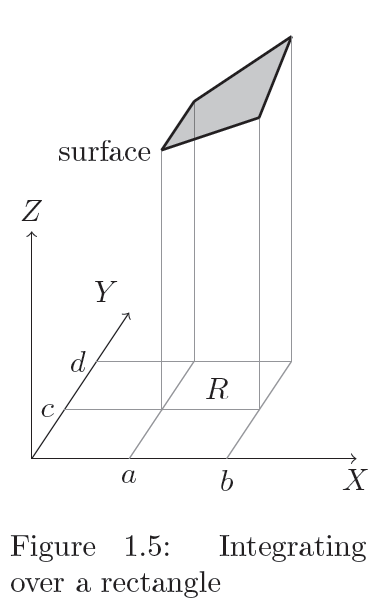
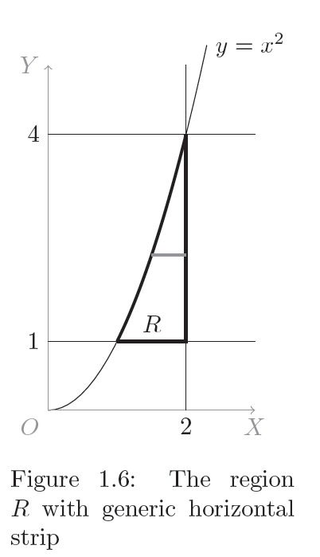
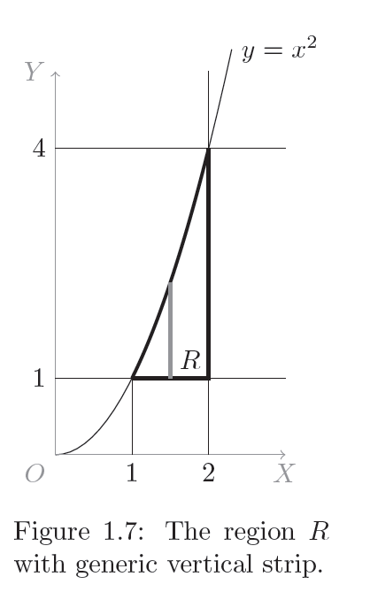
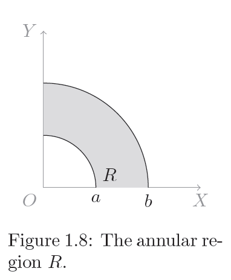

% 6G5Z3001_1314 \\\\ Mathematical Methods
% Killian O'Brien
% Nov 2013
$\newcommand{\pderiv}[2]{\frac{\partial #1}{\partial #2}}
\newcommand{\ppderiv}[2]{\frac{\partial^2 #1}{\partial #2}}$

# Multi-variable calculus

## Multi-variable calculus \\\\ Line integrals \\\\ Application to physics (sec. 1.13)

In general terms the work done by the force when it moves a body in the same direction of the force is
$$
\text{work} = \text{force} \times \text{displacement} .
$$

When the body moves in a direction which is not the same as that of the force then we have to consider the \emph{component} of the force in the direction of movement. Suppose a force in three dimensions is modelled using the vector quantity $\mathbf{F}$,
$$
\mathbf{F} = F_x \mathbf{i} + F_y \mathbf{j} + F_z \mathbf{k},
$$
and the position of a body is given by the position vector $\mathbf{r}$,
$$
\mathbf{r} =  r_x \mathbf{i} + r_y \mathbf{j} + r_z \mathbf{k}.
$$
Then the work done when the body moves along a path $C$ is given by the path integral
$$
\begin{align}
\text{work done} &= \int\limits_C \, \mathbf{F} . d \mathbf{r} \\
&= \int\limits_C \, F_x \, dx + F_y \, dy + F_z \, dz .
\end{align}
$$

### Example 1.17

A two-dimensional example. Find the work done by a force 
$$
\mathbf{F} = (3x^2 + 4y^2 ) \mathbf{i} + (xy) \mathbf{j},
$$
when it moves a particle along a path $C$ which is defined by the relationship $y=x^3$ for $0 \leq x \leq 2$.

## Multi-variable calculus \\\\ Double integrals (sec. 1.14)

Let $R$ denote the rectangle in the $xy$-plane over the range $a \leq x \leq b$ and $c \leq y \leq d$. The integral
$$
I = \iint\limits_{R} \, f(x,y) \, dx \, dy,
$$
denotes the *double integral* of $f$ over the region $R$. **This represents the volume lying over the region $R$ and below the surface defined by $f$.** Such integrals can be evaluated by treating them as *repeated integrals*, i.e. a system of nested integrals which can be evaluated by beginning with the innermost integral and working out,
$$
\begin{align}
I &= \iint\limits_{R} \, f(x,y) \, dx \, dy, \\
&= \int_c^d \, \left ( \int_a^b \, f(x,y) \, dx \right ) \, dy.
\end{align}
$$

### Example 1.18

Integrate the function 
$$
f(x,y) = 2xy + 4x + 3y + 1,
$$
over the ractangular region bounded by $x=0$, $x=2$, $y=1$ and $y=3$. 

## Multi-variable calculus \\\\ Evaluation techniques: seperable functions and reversing the order (sec. 1.15)

In the special case where the function $f$ is \emph{separable}, i.e.
$$
f(x,y) = g(x) h(y),
$$
then the integral over a rectangular region becomes the product of the two integrals as follows
$$
\int_c^d \int_a^b \, f(x,y) \, dx \, dy 
= \left ( \int_c^d \, h(y) \, dy \right ) \left ( \int_a^b \, g(x) \, dx \right ) .
$$
Another technique that can be used is reversing the order of integration, i.e.
$$
\int_c^d \int_a^b \, f(x,y) \, dx \, dy 
= \int_a^b \int_c^d \, f(x,y)  \, dy \, dx .
$$

### Example 1.19

Evaluate the integral 
$$
I = \int_0^1 \int_{0.2}^{0.8} \, x \cos(xy) \, dx \, dy .
$$

## Multi-variable calculus \\\\ Double integrals over non-rectangular regions (sec. 1.16)

Non-rectangular regions are characterised by limits for the $x$ and/or $y$ variables that are not constants. Such integrals can still be evaluated by considering them as repeated integrals. However care is needed when reversing the order of integration as this will require careful handling of the limits of integratio, as shown by the following examples. 

### Example 1.20

Integrate the function 
$$
f(x,y) = 4x^3 + 4y^3, 
$$
over the region $R$ bounded by the $x=2$, $y=1$ and $y=x^2$. 

*See notes and visualizer for evaluation*

## Multi-variable calculus \\\\ Changing coordinates (sec. 1.17)

In all the examples we have met so far we have consistently integrated using the usual Cartesian coordinate system $(x,y)$. It is possible however to integrate with respect to other coordinate systems. 

Recall that in the single-variable case we can use the technique of substitution,
$$
\int \, f(x) \, dx = \int \, f \big ( x(t) \big ) \frac{dx}{dt} \, dt .
$$
This converts/translates the original integral, which was with respect to the variable $x$, to an equivalent integral which is now with respect to the variable $t$.

For multi-variable integrals we translate to a new coordinate system using the absolute value of the Jacobian determinant of the transformation as follows,
$$
\iint\limits_{R} \, f(x,y) \, dx \, dy 
= \iint\limits_{R} \, f \big ( x(s,t), \, y(s,t) \big ) \left | \frac{\partial (x,y)}{\partial (s,t)} \right | \, ds \, dt . \label{E:multisubs}
$$

### Example 1.21

Evaluate the integral 
$$
\iint\limits_{R} \, \frac{1}{x^2 + y^2} \, dx \, dy ,
$$
where $R$ is the annular region in the plane bounded by the circles of radius $a$ and $b$ in the 1st quadrant as shown in figure.

This approach generalises to dealing with integrals of functions of three or more variables. When changing from a coordinate system $(x_1, \dots, x_n)$ to a new coordinate system $(u_1, \dots , u_n)$ we use
$$
\begin{align}
&\idotsint\limits_{R}\, f(x_1, \dots, x_n) \, dx_1  \dots  \, dx_n \label{E:gensubs}\\
&= \idotsint\limits_{R} \, f \big (\dots x_i(u_1,\dots,u_n),\dots \big ) \left | \frac{\partial (x_1,\dots, x_n)}{\partial (u_1, \dots , u_n)} \right | \, du_1  \dots du_n . \nonumber
\end{align}
$$

 
 <!--- 
 

 </script>
 

[`cloud.sagemath.com`](https://cloud.sagemath.com).
 --->
