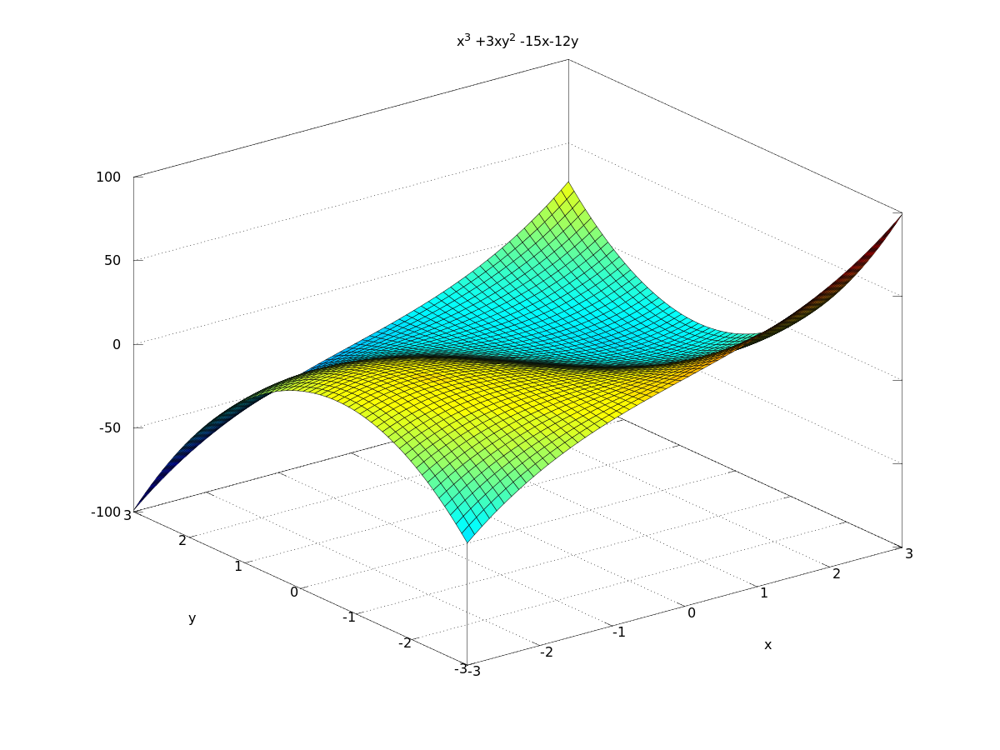
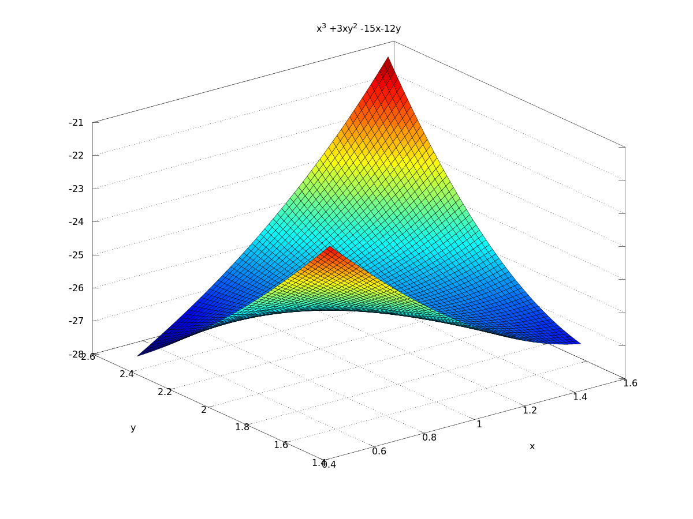
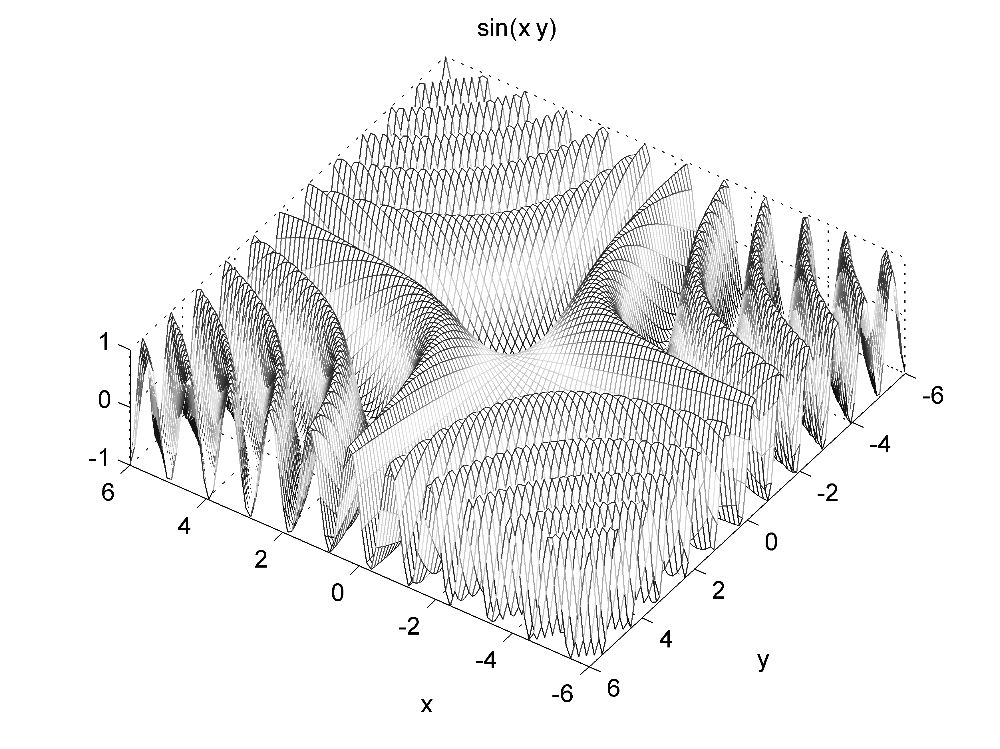

% 6G5Z3001_1314 \\\\ Mathematical Methods
% Killian O'Brien
% Oct 2013
$\newcommand{\pderiv}[2]{\frac{\partial #1}{\partial #2}}
\newcommand{\ppderiv}[2]{\frac{\partial^2 #1}{\partial #2}}$

# Multi-variable calculus

## Multi-variable calculus \\\\ Taylor's theorem (sec. 1.9)

Recall that Taylor's theorem for functions of a single variable allowed one to approximate the value of a function at arguments close to a base point $a$ by a polynomial ... where the coefficients of the polynomial were the derivatives of the function evaluated at the base point.

$$
\begin{align*}
f(a + h) &= f(a) + f'(a) h + \frac{1}{2} f''(a) h^2 + \dots \\
&= \sum_{n=0}^\infty  \frac{1}{n!} f^{(n)}(a) h^n .
\end{align*}
$$

It is also possible to approximate function values in the multi-variable cases as well. 

### Two-variable Taylor series

In the following we shall use $(a,b)$ as the base point for the expansion and $h$ and $k$ for the changes in the variables, i.e.
$$ 
h = \Delta x , \text{ and } k = \Delta y .
$$
We shall write $D$ for the differential operator,
$$ 
D = h \pderiv{}{x} + k \pderiv{}{y}.
$$
As $D$ is an *operator*, an (integer) power of $D$ denotes the composition of the appropriate number of instances of $D$. So, for instance, 
$$ 
Df = h \pderiv{f}{x} + k \pderiv{f}{y},
$$
and 
$$
\begin{align}
D^2 f &= D(D(f)) \\
&=\left ( h \pderiv{}{x} + k \pderiv{}{y} \right ) Df, \\
&= \left ( h \pderiv{}{x} + k \pderiv{}{y} \right ) \left ( h \pderiv{f}{x} + k \pderiv{f}{y} \right ), \\
&= h^2 \ppderiv{f}{x^2} + k^2 \ppderiv{f}{y^2} + 2 hk \ppderiv{f}{x \partial y} .
\end{align}
$$
The statement of Taylor's theorem is then very similar to the 1-variable case.

### Theorem 1.3 (Taylor's theorem)

In any region about the point $(a,b)$ where $f$ and all its derivatives are continuous,
$$
\begin{align} 
f(a+ h,b+k)&= \sum_{n=0}^\infty \frac{1}{n!} D^n f(a,b) , \\
&=f(a,b) + Df(a,b) + \frac{1}{2!} D^2 f (a,b) + \frac{1}{3!} D^3 f (a,b) + \dots .
\end{align}
$$

Taking finite partial sums of the infinite Taylor series, so called *Taylor polynomials* will provide approximations to the value of the function. The more terms included in the partial sum and the smaller the changes $h$ and $k$, the better will be the approximation.  

### Example 1.11 

Find the Taylor expansion of order 2 of the function  
$$
f(x,y) = \sin(x + 3y) + \cos(3x + y) 
$$
about the point $\left ( \frac{\pi}{2} , 0 \right )$. 

## Multi-variable calculus \\\\ Extreme values of functions of two variables (sec. 1.10)

First, an example which we can understand from a single-variable perspective.

### Example 1.12

The surface generated by the function 
$$ z = f(x,y) = \left ( x^2 + y^2 \right )^2 - 8 \left ( x^2 + y^2 \right ) + 20 ,
$$
can be obtained by rotating the generated by the function 
$$
z=f(x) = x^4 -8x^2 + 20
$$
about the $z$-axis.

Using the fact that $f'(x) = 4x(x^2-4)$ we know that $f$ has a local maximum at $x=0$ and a local minimum at $x=\pm 2$. Hence the surface generated by $x=f(x,y)$ will have a local maximum at the origin $x=y=0$ and local minima at all points on the circle given by $x^2+y^2=4$.

~~~
ezsurf(' (x^2 + y^2)^2 - 8*( x^2 + y^2) + 20',[-3,3,-3,3])
~~~

... However not all two-variable functions have such a structure and so we need to know in general how to identify stationary points of such functions and determine their nature.

### Definition 1.8 (Stationary point)
Suppose that $z=f(x,y)$ is a function of two-variables whose first and second order partial derivatives exist. A \emph{stationary point} of $f$ is a point $(x_0,y_0)$ where the first order partial derivatives vanish, i.e.
$$
f_x (x_0,y_0) = f_y (x_0,y_0) = 0.
$$
Stationary points are also referred to as *critical points*.

In order to determine the nature of the stationary point we need to examine the values of the second-order partial derivatives at the point $(x_0,y_0)$. 

### Definition 1.9 (Hessian matrix/determinant)
Suppose that $z=f(x,y)$ is a function of two-variables. The *Hessian* matrix of $f$ is the matrix, $\mathcal{H}(f)$ of second-order partial derivatives,
$$
\mathcal{H}(f) = \left ( 
\begin{array}{cc}
f_{xx}& f_{xy} \\
f_{yx} & f_{yy}
\end{array}
\right ) .
$$

### Classification method

To classify a stationary point $(x_0, y_0)$ we evaluate the determinant of the Hessian matrix at the point to get 
$$
D = D(x_0,y_0) = \left | \mathcal{H}(f) \right |_{(x_0,y_0)}.
$$
The point is then classified as follows,

* if $D > 0$ and $f_{xx}(x_0, y_0) > 0$ then $(x_0,y_0)$ is a local minimum,

* if $D > 0$ and $f_{xx}(x_0, y_0) < 0$ then $(x_0,y_0)$ is a local maximum,

* if $D < 0$ then $(x_0,y_0)$ is a saddle point. 

### Example 1.13 
Consider the function 
$$
z = f(x,y) = x^3 + 3 x y^2 - 15 x - 12 y.
$$
Find the stationary points of this function.

## Example 1.13 \\\\ Using the computer

 

The nature of the stationary points can be appreciated from the plots

Obtain plots like these using Matlab ``ezsurf`` command e.g.

~~~
ezsurf('x^3 + 3*x*y^2 -15*x - 12*y',[-3,3,-3,3])
~~~

## Multi-variable calculus \\\\ Further example of Taylor series and stationary points

### Problem

Use the two-variable Taylor series of $\sin{(xy)}$ to prove that the surface defined by $z=\sin{(xy)}$ has maxima at every point on the surface lying over the curve represented by $y=\frac{\pi}{2x}$ in the $(x,y)$-plane.

### Solution

Evaluating the Hessian determinant $D$ does not help in this case as it evaluates to $0$ at every point along the given curve. This is because the stationary points here are not isolated. 

We will obtain the Taylor series expansion of $z\left (x,y\right )=\sin\left (xy\right )$ around the point $\left (a, \frac{\pi}{2a}\right )$ including terms up to order 2. As the quantity $a$ varies this point traces out one of the `ridge' curves in the $xy$-plane. The series is given by 
$$
z\left (a + h, \frac{\pi}{2a} + k\right ) = z\left (a, \frac{\pi}{2a}\right ) + \left (Dz\right )\left (a, \frac{\pi}{2a}\right ) + \frac{1}{2}  \left (D^2z\right )\left (a, \frac{\pi}{2a}\right ) + \dots \label{E:taylor}
$$
where $D$ and $D^2$ are the differential operators 
$$
D= h \frac{\partial}{\partial x} + k \frac{\partial}{\partial y}, \quad D^2 = h ^2 \frac{\partial^2}{\partial x^2} + k^2 \frac{\partial^2}{\partial y^2} + 2hk \frac{\partial^2}{\partial x \partial y}.
$$
The various partial derivatives of $z$ needed for this have all been obtained in part (b) above. Evaluating these at the point $\left (a, \frac{\pi}{2a}\right )$ we get 
$$
\begin{align}
 \left (Dz\right )\left (a, \frac{\pi}{2a}\right ) &=0 , \\
 \left (D^2z\right )\left (a, \frac{\pi}{2a}\right ) &= \frac{- \pi^2}{4a^2} h^2 - a^2 k^2 - \pi hk  = -\left ( \frac{\pi}{2a} h + ak \right )^2.
\end{align}
$$
Returning to the Taylor series we get 
$$
z\left (a + h, \frac{\pi}{2a} + k\right ) = 1 - \frac{1}{2}  \left ( \frac{\pi}{2a} h + ak  \right )^2 + \dots . 
$$
Now we are concerned with the behaviour of the function close to the base point of the expansion, i.e. the small variations $h$ and $k$ are just that, small. For small $h$, $k$ (with absolute value very much less than 1) the behaviour of the Taylor series expansion, and in particular whether it is greater than or less than 1 will only depend on the value of the expansion taken up to the second order terms in $h$ and $k$ which we have above. This is because the higher order terms in $h^3$ etc will have absolute value very much less than $h^2$ etc. But from series approximation above the value of this expansion is 1 minus a square, so it is always less than or equal to 1 for any (small enough) changes $h$ and $k$.

This allows us to conclude that the point $\left (a, \frac{\pi}{2a}\right )$ is a local minimum of the surface (surface shown below)

 

 
 <!--- 
 

 </script>
 

[`cloud.sagemath.com`](https://cloud.sagemath.com).
 --->
