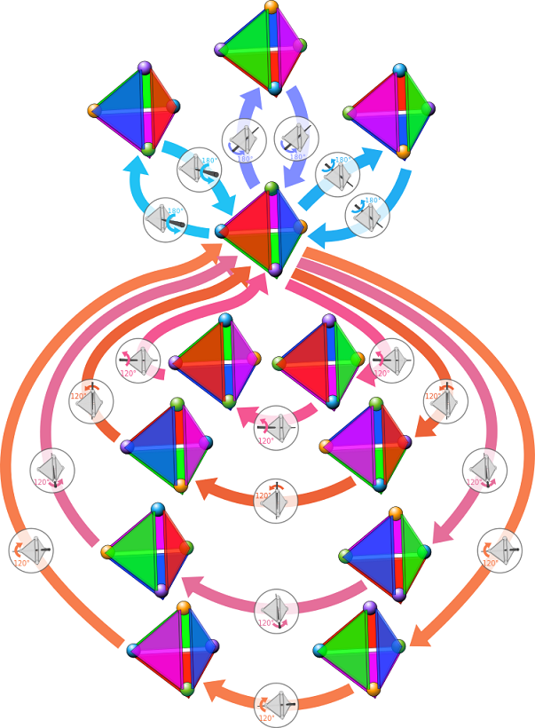
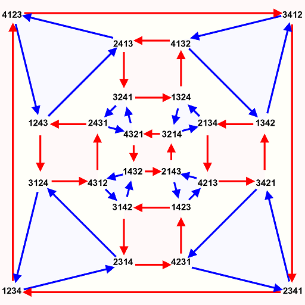
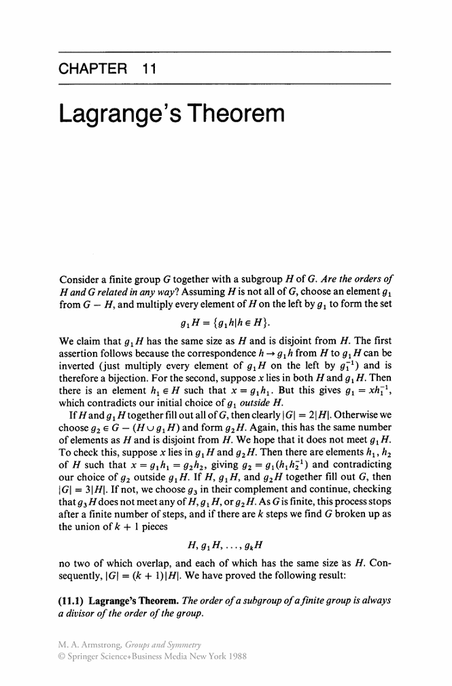
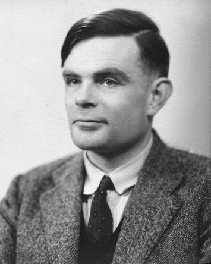

# Group Theory (6G6Z3012)

## What is a group?

A set $G$ with a binary operation $\star$ satisfying

* $G$ is a closed system under $\star$,
* $\star$ is associative on $G$,
* $G$ contains an identity element for $\star$,
* $G$ contains inverse elements for $\star$ .

Groups arise in many different contexts in mathematics.

## Syllabus topics

### Introduction to group theory: 

Binary operations on sets and definition of a group with examples. Cayley tables.

### Examples of groups: 

Symmetry groups of two and three-dimensional objects, the dihedral groups $D_n$, rotational symmetry groups of three-dimensional polyhedra. Permutation groups, the Symmetric groups $S_n$ and the Alternating groups $A_n$. Number based groups under arithmetic operations, the cyclic groups $\mathbb{Z}_n$. Groups of matrices.

## Rotational symmtry groups of 2D & 3D solids

### Visualising the elements of $\Gamma^+(\text{Tetrahedron})$

## The Symmetric group, $S_4$, on four objects

## Syllabus topics

### Initial group theory: 

Various concept definitions and examples, including: elements, orders, Abelian groups, subgroups, generators and cyclic/non-cyclic. The natural mappings between groups, homomorphisms and isomorphisms. Examples of isomorphic pairs and non-isomorphic pairs. Cayley's theorem: Every group isomorphic to a group of permutations.

### Classification problems: 

What are the grand enterprises of group theory? What classification problems can be posed?

### Lagrange's theorem: 

Restricting the possibilities for subgroup orders. Equivalence relations, equivalence classes, cosets. Normal groups and quotient groups.

## Lagrange's theorem

## Syllabus topics

### Group presentations: 

How to systematically describe groups in a computable way. Group presentations, generators and relations, presentation matrices. The isomorphism decision problem based on matrices. 

### The classification of finitely presented Abelian groups: 

A matrix reduction algorithm to decide the isomorphism problem amongst finitely presented Abelian groups. The canonical form of finitely presented Abelian group as a direct sum of cyclic groups. 

### Classification of groups of low order: 

What about non-Abelian groups? Why we can't solve using matrix reduction? Investigation of groups of low order and enumeration and classification of all groups up to some suitable order.

## Syllabus topics

### Sylow's theorems: 

Discussion of the converse to Lagrange's theorem. Group actions, orbits, stabilizers. Self-action by conjugation. Sylow's theorems. 

## Wider interest material / applications

The unit could contain interesting general material on the following topics/applications.

### The classification of finite simple groups

The grand project. Status of the proof. Some history and biographical details of the completion of the project. The families in the classification. The sporadic groups. The Monster group and Monstrous Moonshine.

#### The Monster group

A group, $M$, with approx. $8 \times 10^{53}$ elements, that is *simple*, i.e. it has no *normal* subgroups.

$M$ is (isomorphic to) a group of rotations of 196883-dimensional space. 

$M$ is (isomorphic to) a group of matrices generated by two particular binary $196882 \times 196882$ matrices.

## Wider interest material / applications

### Algorithmic problems

The word problem. Computability. Alan Turing.

### Combinatorial enumeration and geometric classification problems

Counting number of distinguishable colourings of geometric objects. Classifying the symmetry types of two-dimensional wallpaper patterns. Classifying two and three-dimensional crystal structures (lattices). 

## Wider interest material / applications

### Galois theory

Life of Galois (1811 - 1832). Galois theory. Formulas for roots of polynomials. Construction problems with ruler and compass.

## Teaching team, teaching pattern & assessment

* Unit designed by Killian O'Brien & Seamus O'Shea

* Taught by Killian , ...

* 2 hours lecture + 1 hour tutorial (or sometimes computer lab) per week.

* Assessment is by Coursework Report (40%) and Summer Exam (60%).

## Nature of the unit

* A thorough introduction to a substantial area of pure mathematics that has strong connections to areas of geometry, combinatorics, graph theory, ... .

* Definately suited to students who like problem solving and the unit will develop your skills in this area.

* We will use the Sage mathematics system to aid our investigations. You will also get an introduction to the Python programming language.  ([www.sagemath.org](http://www.sagemath.org), [cloud.sagemath.org](https://cloud.sagemath.org), [sagecell.sagemath.org](https://sagecell.sagemath.org))

