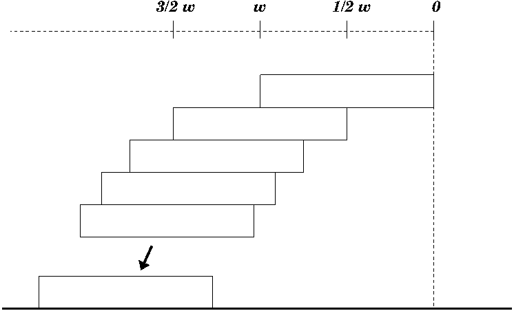
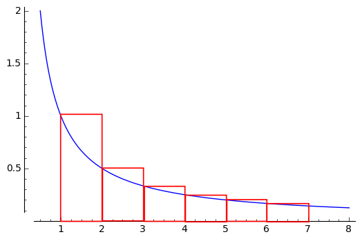
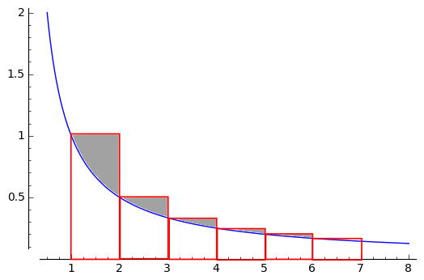
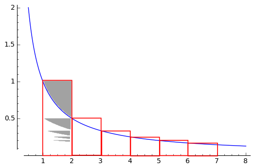

% 6G4Z3001_1314 \\\\ Mathematics Fundamentals
% Killian O'Brien
% Oct 2014
# Series 01

## Series \\\\ Introduction

Work through chapter 2 in the notes up to Example 2.3 on the harmonic series. 

## Series \\\\ Stacking blocks

Let $h_n$ denote the overhang of this optimal simple stack of $n$ blocks, each of width $w$. The overhang $h_n$ is measured from the rightmost edge of the top block back to the rightmost edge of the bottom block.

To create the stack of $n$ blocks we place the optimal stack of $n-1$ blocks on top of the bottom block. The best way of doing this is to position the centre of gravity of the stack of $n-1$ blocks directly over the edge of the bottom block.

So we see that 
$$
\begin{align*}
h_n &= \text{ overhang obtained from optimal stack of $n$ blocks} \\
&= \text{ centre of gravity of the upper $n-1$ blocks}
\end{align*}
$$

Using this we can develop a recurrence relation for the value of $h_n$

$$
\begin{align*}
h_1 & = 0 , \\
h_n &= h_{n-1} + \frac{1}{n-1} \frac{w}{2}
\end{align*}
$$

The right hand side of the recurrence relation can be understood as a weighted averaging of the positions of the centres of gravity of the blocks in the stack.

Applying this recurrence relation to develop the sequence $\left \{ h_n \right \}$ will show the presence of the harmonic series more clearly.

$$
\begin{align*}
h_1 & = 0 , \\
h_2 &= \frac{w}{2}, \\
h_3 &= \frac{w}{2} + \frac{1}{2} \frac{w}{2} = \frac{w}{2} \left ( 1 + \frac{1}{2} \right ) , \\
h_4 &= \frac{w}{2} \left ( 1 + \frac{1}{2} \right ) + \frac{1}{3} \frac{w}{2} = \frac{w}{2} \left ( 1 + \frac{1}{2} + \frac{1}{3} \right ) \\
&\vdots \\
h_n &= \frac{w}{2} \left (  1 + \frac{1}{2} + \frac{1}{3} + \dots + \frac{1}{n-1} \right )
\end{align*}
$$
 
## Series \\\\ Stacking blocks

### Obtaining a value for $h_n$

$$h_n = \frac{w}{2} \left (  1 + \frac{1}{2} + \frac{1}{3} + \dots + \frac{1}{n-1} \right )$$

$$h_n \approx \frac{w}{2} \int_1^n \, \frac{1}{x} \, dx $$

$$h_n = \frac{w}{2} \left ( \int_1^n \, \frac{1}{x} \, dx + \gamma_n \right ),$$
where 
$$\gamma_n = \text{ area of shaded regions }$$

$$ \lim_{n \to \infty} \gamma_n = \gamma \approx 0.6$$

$\gamma$ is the Euler–Mascheroni constant.

So for large $n$ a very good approximation is 
$$
\begin{align*}
h_n &\approx \frac{w}{2} \left ( \int_1^n \, \frac{1}{x} \, dx + 0.6 \right ), \\
&= \frac{w}{2} \Big ( \log(n)+ 0.6 \Big ).
\end{align*}
$$

## Series \\\\ Stacking blocks

### An actual stack of Jenga blocks 

$$h_n \approx \frac{w}{2} \Big ( \log(n)+ 0.6 \Big )$$

#### How tall is a simple optimal stack with a $3$ metre overhang?

The Jenga block is $7.5$cm wide and $1.5$cm tall.

$$3 = \frac{0.075}{2} \Big ( \log(n) + 0.6 \Big )$$

Solve this to find number, $n$, of blocks required.

$$
\begin{align*}
n &= e^{\left ( \frac{3}{0.0375} - 0.6 \right )} \\
&\approx 3.0 \times 10^{34}, \text{ a LOT of bricks}
\end{align*}
$$

Such a stack would be $3.0 \times 10^{34} \times 0.015 \approx 4.6 \times 10^{32}$ metres tall.

### Now that's tall!

$4.6 \times 10^{32}$ metres is approximately $520 \, 000$ times the diameter of the observable universe.

### Further reading

Read more about better overhangs that can be achieved with more complicated stacking strategies in the article 

*Overhang*, by Mike Paterson and Uri Zwick, The American Mathematical Monthly , Vol. 116, No. 1 (Jan., 2009), pp. 19-44. Available from [JSTOR](http://www.jstor.org/stable/27642662)

 <!--- 
 

 </script>
 
 --->
=======
% 6G4Z3001_1314 \\\\ Mathematics Fundamentals
% Killian O'Brien
% Oct 2013
# Series 01

## Series \\\\ Introduction

Work through chapter 2 in the notes up to Example 2.3 on the harmonic series. 

## Series \\\\ Stacking blocks

Let $h_n$ denote the overhang of this optimal simple stack of $n$ blocks, each of width $w$. The overhang $h_n$ is measured from the rightmost edge of the top block back to the rightmost edge of the bottom block.

To create the stack of $n$ blocks we place the optimal stack of $n-1$ blocks on top of the bottom block. The best way of doing this is to position the centre of gravity of the stack of $n-1$ blocks directly over the edge of the bottom block.

So we see that 
$$
\begin{align*}
h_n &= \text{ overhang obtained from optimal stack of $n$ blocks} \\
&= \text{ centre of gravity of the upper $n-1$ blocks}
\end{align*}
$$

Using this we can develop a recurrence relation for the value of $h_n$

$$
\begin{align*}
h_1 & = 0 , \\
h_n &= h_{n-1} + \frac{1}{n-1} \frac{w}{2}
\end{align*}
$$

The right hand side of the recurrence relation can be understood as a weighted averaging of the positions of the centres of gravity of the blocks in the stack.

Applying this recurrence relation to develop the sequence $\left \{ h_n \right \}$ will show the presence of the harmonic series more clearly.

$$
\begin{align*}
h_1 & = 0 , \\
h_2 &= \frac{w}{2}, \\
h_3 &= \frac{w}{2} + \frac{1}{2} \frac{w}{2} = \frac{w}{2} \left ( 1 + \frac{1}{2} \right ) , \\
h_4 &= \frac{w}{2} \left ( 1 + \frac{1}{2} \right ) + \frac{1}{3} \frac{w}{2} = \frac{w}{2} \left ( 1 + \frac{1}{2} + \frac{1}{3} \right ) \\
&\vdots \\
h_n &= \frac{w}{2} \left (  1 + \frac{1}{2} + \frac{1}{3} + \dots + \frac{1}{n-1} \right )
\end{align*}
$$
 
## Series \\\\ Stacking blocks

### Obtaining a value for $h_n$

$$h_n = \frac{w}{2} \left (  1 + \frac{1}{2} + \frac{1}{3} + \dots + \frac{1}{n-1} \right )$$

$$h_n \approx \frac{w}{2} \int_1^n \, \frac{1}{x} \, dx $$

$$h_n = \frac{w}{2} \left ( \int_1^n \, \frac{1}{x} \, dx + \gamma_n \right ),$$
where 
$$\gamma_n = \text{ area of shaded regions }$$

$$ \lim_{n \to \infty} \gamma_n = \gamma \approx 0.6$$

$\gamma$ is the Euler–Mascheroni constant.

So for large $n$ a very good approximation is 
$$
\begin{align*}
h_n &\approx \frac{w}{2} \left ( \int_1^n \, \frac{1}{x} \, dx + 0.6 \right ), \\
&= \frac{w}{2} \Big ( \log(n)+ 0.6 \Big ).
\end{align*}
$$

## Series \\\\ Stacking blocks

### An actual stack of Jenga blocks 

$$h_n \approx \frac{w}{2} \Big ( \log(n)+ 0.6 \Big )$$

#### How tall is a simple optimal stack with a $3$ metre overhang?

The Jenga block is $7.5$cm wide and $1.5$cm tall.

$$3 = \frac{0.075}{2} \Big ( \log(n) + 0.6 \Big )$$

Solve this to find number, $n$, of blocks required.

$$
\begin{align*}
n &= e^{\left ( \frac{3}{0.0375} - 0.6 \right )} \\
&\approx 3.0 \times 10^{34}, \text{ a LOT of bricks}
\end{align*}
$$

Such a stack would be $3.0 \times 10^{34} \times 0.015 \approx 4.6 \times 10^{32}$ metres tall.

### Now that's tall!

$4.6 \times 10^{32}$ metres is approximately $520 \, 000$ times the diameter of the observable universe.

### Further reading

Read more about better overhangs that can be achieved with more complicated stacking strategies in the article 

*Overhang*, by Mike Paterson and Uri Zwick, The American Mathematical Monthly , Vol. 116, No. 1 (Jan., 2009), pp. 19-44. Available from [JSTOR](http://www.jstor.org/stable/27642662)

 <!--- 
 

 </script>
 
 --->

