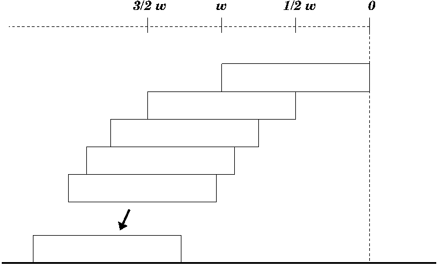

% title: Surprising our intuitions
% subtitle: unexpected mathematical facts from stacking blocks and three-dimensional rotations
% author: slides at tinyurl.com/surprising0714
% author:   
% author: Killian O'Brien
% author: School of Computing, Mathematics & Digital Technology
% author: Manchester Metropolitan University
% thankyou: Go raibh míle maith agaibh
% thankyou_details:
% contact: email <a href="mailto:k.m.obrien@mmu.ac.uk">k.m.obrien@mmu.ac.uk</a>
% contact: twitter <a href="https://twitter.com/killianobrien">@killianobrien</a>
% favicon: http://www2.mmu.ac.uk/media/mmuacuk/style-assets/images/favicon.ico

---
title: 
class: fill nobackground

<footer class="source"> source: <a href="http://www.geograph.org.uk/photo/2953864">Anthony Parkes</a>

---
title: The challenge
subtitle: Make a tower of blocks with a large overhang
class: segue dark nobackground

---
title: Does this look odd?
class: fill nobackground

---
title: An optimal solution for simple stacking
subtitle: but not optimal in general
build_lists: true

A couple of basic principles

- A body balances on a flat surface if its centre of gravity lies over its footprint
- The location of the centre of gravity of a stack of blocks can be determined by averaging over the locations of the centres of gravity of the individual blocks

Iterate the following construction

- Build the stack by adding extra blocks to the bottom of the stack
- When adding a block position its edge directly under the centre of gravity of the existing stack in order to maximize the overhang

---
title: Analyzing this solution
subtitle: Defining $h_n$
class: 

Let $h_n$ denote the overhang of this optimal simple stack of $n$ blocks, each of width $w$.

Using previous principles we get that $h_n$ is also the centre of gravity of the upper $n-1$ blocks.

---
title: Analyzing this solution
subtitle: A recurrence relation for $h_n$
class: smaller

A stack consisting of a single block has no overhang, so

$h_1 = 0.$

The overhang for a stack of $n$ blocks is the centre of gravity of the upper $n-1$ blocks which itself is the centre of gravity of the upper $n-2$ blocks plus the weighted contribution of the $(n-1)^{th}$ block, so

$h_n = h_{n-1} + \dfrac{1}{n-1} \dfrac{w}{2}.$

---
title: Analyzing this solution
subtitle: Developing the sequence $h_1, h_2, h_3, \dots$

$$\begin{align*}
h_1 & = 0 , \\
h_2 &= \frac{w}{2}, \\
h_3 &= \frac{w}{2} + \frac{1}{2} \frac{w}{2} = \frac{w}{2} \left ( 1 + \frac{1}{2} \right ) , \\
h_4 &= \frac{w}{2} \left ( 1 + \frac{1}{2} \right ) + \frac{1}{3} \frac{w}{2} = \frac{w}{2} \left ( 1 + \frac{1}{2} + \frac{1}{3} \right ) \\
&\vdots \\
h_n &= \frac{w}{2} \left (  1 + \frac{1}{2} + \frac{1}{3} + \dots + \frac{1}{n-1} \right )
\end{align*}$$

---
title: Analyzing this solution
subtitle: Overhang $h_n$ is governed by the harmonic series
class: 

$h_n = \frac{w}{2} \left (  1 + \frac{1}{2} + \frac{1}{3} + \dots + \frac{1}{n-1} \right )$ and the harmonic series $1 + \frac{1}{2} + \frac{1}{3} + \dots + \frac{1}{n-1}$ increases without any upper bound.

$$\begin{align}
& 1 + \frac{1}{2} + \left ( \frac{1}{3} + \frac{1}{4} \right ) + \left ( \frac{1}{5} + \dots + \frac{1}{8}
\right )  + \left ( \frac{1}{9} + \dots + \frac{1}{16} \right ) + \dots \\
\gt & 1 + \frac{1}{2} + \frac{2}{4} + \frac{4}{8} +  \frac{8}{16} + \dots  \\
= & 1 + \frac{1}{2} + \frac{1}{2} + \frac{1}{2} + \frac{1}{2} + \dots
\end{align}$$

Conclusion: Given enough blocks one can achieve any overhang whatsoever!

---
title: Evaluating $h_n$

We can view the harmonic series as the sum of the areas of a sequence of rectangles. The sum of these areas is approximated by the integral of the function $\frac{1}{x}$. 

$h_n = \frac{w}{2} \left (  1 + \frac{1}{2} + \frac{1}{3} + \dots + \frac{1}{n-1} \right )$

$h_n \approx \frac{w}{2} \int_1^{n} \, \frac{1}{x} \, dx $

---
title: Evaluating $h_n$

$h_n \approx \frac{w}{2} \int_1^{n} \, \frac{1}{x} \, dx $

Let $\gamma_n$ denote the area of the shaded areas, then 

$h_n = \frac{w}{2} \left ( \int_1^n \, \frac{1}{x} \, dx + \gamma_n \right ) .$

---
title: Evaluating $h_n$

$h_n \approx \frac{w}{2} \int_1^{n} \, \frac{1}{x} \, dx $

Let $\gamma_n$ denote the area of the shaded areas, then 

$h_n = \frac{w}{2} \left ( \int_1^n \, \frac{1}{x} \, dx + \gamma_n \right ).$

Now $\lim_{n \to \infty} \gamma_n = \gamma \approx 0.6$, the Euler-Mascheroni constant. So for large $n$, a very good approximation is 

$$ h_n \approx \frac{w}{2} \left ( \int_1^n \, \frac{1}{x} \, dx + 0.6 \right ) 
= \frac{w}{2} \left ( \log(n) + 0.6 \right ) .$$

---
title: An actual stack of Jenga blocks with 3m overhang

$$h_n \approx \frac{w}{2} \Big ( \log(n)+ 0.6 \Big )$$

**How tall is a simple optimal stack with a $3$ metre overhang?**

The Jenga block is $7.5$cm wide and $1.5$cm tall.
$$3 = \frac{0.075}{2} \Big ( \log(n) + 0.6 \Big )$$
Solve this to find number, $n$, of blocks required.
$$\begin{align*}
n &= e^{\left ( \frac{3}{0.0375} - 0.6 \right )} \\
&\approx 3.0 \times 10^{34}, \text{ a LOT of bricks}
\end{align*}$$
Such a stack would be $3.0 \times 10^{34} \times 0.015 \approx 4.6 \times 10^{32}$ metres tall.

---
title: An actual stack of Jenga blocks with 3m overhang

That is **quite** tall. In fact, $4.6 \times 10^{32}$ metres is approximately 520 000 times the diameter of the observable universe.

Hubble ultra deep field image, June 2014, NASA, ESA, Teplitz et al.,  <a href="http://hubblesite.org/newscenter/archive/releases/2014/27/">Hubblesite.org</a>

---
title: Simulate a stack and read more

<a href="http://sagecell.sagemath.org/?z=eJxtUrGO2zAM3Q34HwhkOKfxXeMAXQpo7ZgfCDrINu2oYcRAonF2v7605OAy1IMhkXyP71HcgVwRhsl34thDS9zdqrle9tDj4DxGsBCwE-tHQhiDfVxdF4HbPxqETydXaFmE70A4CHQcPAawkmg75tA7b0VpEmlZ7NZERKDE3eI4Oj9mnh3YgIDzg6xCOCyKv9_RSywLFfOi7WdZgH4BZQoeHkzLyP7UV5eLZn_XcJkPzcvhcPw4pct21PPgiMwvSxFrFeS6m6qJpqm1JXEwby1N-KZyN8H_88hDygg_srKymM2xLJb1t8Kcd-Isub-Y6qLY7paNpom7EOUJTDnz5S8TnLWaSGeUAH66t7lrqovK_8VbFmfTHJ9yXYSBAxCrNNv3MdXhLME-scKvrjYnG9MK9St70DfH6lSfD81z4rOZ348fP75VzffKvzf7fQ4vZtHwKV-ymWz3AK-m1uyqUPfKEi01xCt_ptYB40SybkLGbXumk9GKKsVqO2M0w_pkSvUPar7dpA==&lang=sage"></a>

Here's a stack of 50 blocks. Click on the image to see (and experiment with) the generating code, thanks to <a href="http://www.sagemath.org/">Sage</a>, a free open-source mathematics software system.

Read more

- <a href="http://www.math.umt.edu/tmme/vol3no1/TMMEv3n1a4.pdf">*Building Blocks Problem Related to Harmonic Series*</a> by Yutaka Nishiyama published in Montana Mathematics Enthusiast. This contains detailed explanations of many of the ideas in this talk.

- <a href= http://arxiv.org/abs/0710.2357>*Overhang*</a> by Mike Paterson & Uri Zwick published in the American Mathematical Monthly.
This article briefly deals with the simple stack before discussing several complex counter-balancing block stacking strategies. There are many references to related articles in the bibliography.

---
title: Rotations in three dimensions
subtitle: Not too hard to understand ...

<iframe height=450px frameborder="0" allowfullscreen src="https://www.youtube.com/embed/ERFV4W8Lt-M" ></iframe>

---
title: Rotations in three dimensions
subtitle: ... but what about this?

The dancer repeatedly rotates the cups, but without dislocating her shoulders.

<iframe align=right height=400px width=auto frameborder="0" allowfullscreen src="https://www.youtube.com/embed/CYBqIRM8GiY?start=68" ></iframe>

---
title: A topological xenoscope
subtitle: (my invented name)

This is a device that allows one to perceive a different three-dimensional topology (shape of space) than what we normally think of as our own. 

---
title: 
class: fill 

---
title: 
class: fill 

---
title:
class: fill 

---
title: 
class: fill 

---
title: 
class: fill 

---
title:
class: fill 

---
title: 
class: fill 

